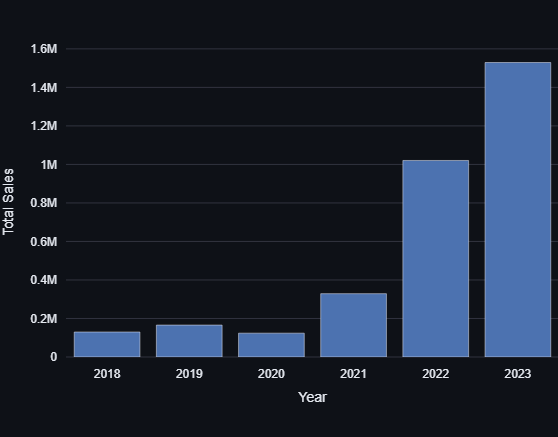
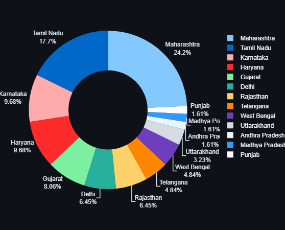
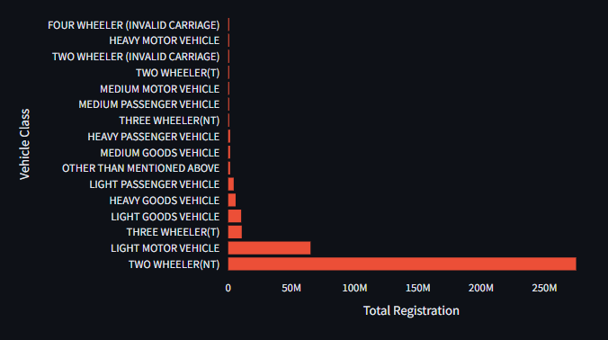
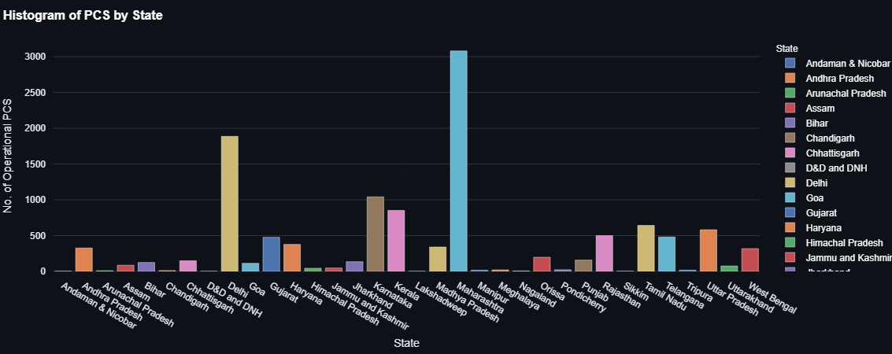
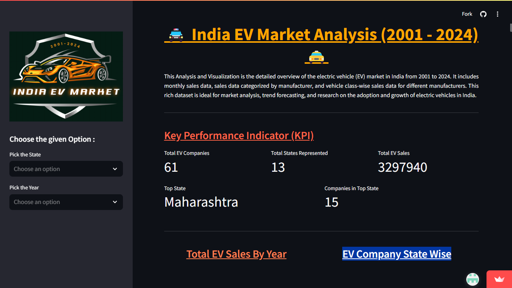
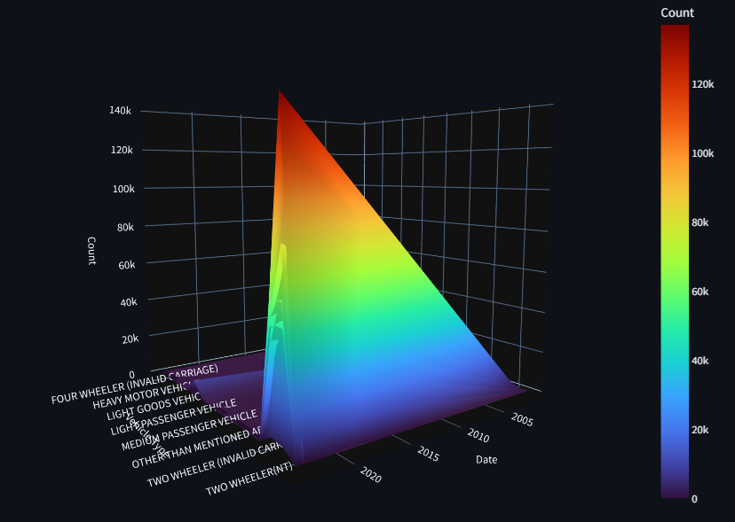
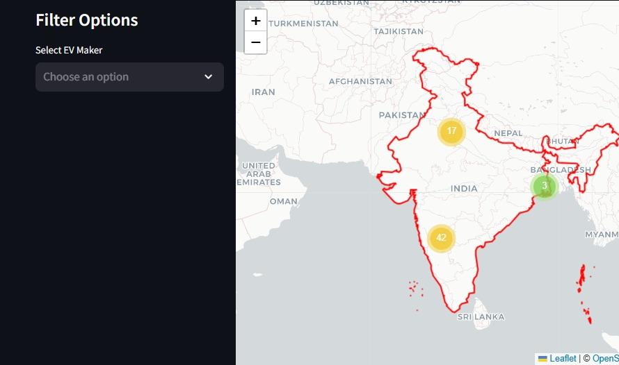

## Project code : B41_DA_004_Analytics Aces ##
# 🚘 Indian EV Market Analysis (2001 - 2024) 🚘


---

# 🚀 Domain: India_EV_Market_Analysis
>🚘[Open Website Link](https://b41da004analytics-aces-jyocqvphdfyov8fij7xspz.streamlit.app/)

---

## 🚔 Overview
This project provides a comprehensive analysis of the Electric Vehicle (EV) market in India, covering the period from 2001 to 2024. The analysis focuses on:
- Growth trends
- Government policies
- Infrastructure developments
- Key players in the EV industry
- Vehicle class-wise and manufacturer-specific sales data
- Consumer preferences and adoption patterns

The interactive web application built with **Streamlit** allows users to explore and visualize the data in an intuitive way.

---

### 🎥 Quick Video Preview
>[Click here to watch a video demo](https://youtu.be/cQyyRON5OTw))

---

## 📌 Key Features

### **1. Interactive Visualizations**
- **Total EV Sales Over the Years:** Track how EV sales have grown annually.
- **State-Wise EV Companies:** View the concentration of EV manufacturers by state using pie charts.
- **Top EV Manufacturers by Growth and Sales:** Identify key players and their performance trends.
- **Category-Wise Sales:** Analyze which types of EVs are the most popular.

### **2. Real-Time Filtering**
- Filter data by state, year, or specific manufacturers to customize insights.

### **3. Advanced Visualizations**
- 3D surface plots for time-series vehicle data.
- Interactive maps showcasing EV manufacturer locations.

### **4. Metrics Dashboard**
- Key Performance Indicators (KPIs) like total sales, top-performing states, and company counts.

---

## 🛠 Technology Stack

### **Languages and Frameworks**
- **Python**: Core programming language for data analysis and app development.
- **Streamlit**: Framework for building the interactive web application.
- **Plotly**: Libraries for dynamic and visually appealing charts.
- **Folium**: Mapping library for geographical visualizations.

### **Data Management**
- **Pandas**: For data manipulation and preprocessing.

### **Additional Tools**
- **Geopandas**: To handle spatial data for maps.
- **Lottie Animations**: For engaging app visuals.

---

## 🚀 How to Run the Application

### **Prerequisites**
1. Install Python 3.8 or above.
2. Install dependencies using pip:
    ```bash
    pip install streamlit pandas numpy plotly folium geopandas streamlit-folium
    ```

### **Steps to Run**
1. Clone the repository:
    ```bash
    git clone 'https://github.com/akashBhaiya/B41_DA_004_Analytics-Aces.git'
    ```
2. Navigate to the project directory:
    ```bash
    cd B41_DA_004_Analytics-Aces
    ```
3. Launch the Streamlit app:
    ```bash
    streamlit run main.py
    ```
4. Open your web browser to the displayed local URL.

---

## 📈 Project Architecture

### **1. Data Collection Layer**
- Raw data is gathered from CSV files and preprocessed for analysis.

### **2. Data Processing Layer**
- Data cleaning and transformation are performed using Pandas.
- Aggregation and calculations for KPIs are carried out in Python.

### **3. Visualization and Front-End Layer**
- Built with Streamlit for dynamic user interaction.
- Visualized with Plotly and Folium for comprehensive insights.

---

## 📊 Visual Insights

### 1. **Yearly EV Sales**

> *Bar chart showcasing annual EV sales from 2001 to 2024.*

### 2. **State-wise EV Market Analysis**

> *Pie chart revealing state-wise EV company distribution.*

### 3. **Vehicle Class Registration Summary**

> *Horizontal bar chart comparing Vehiale Class Registration.*

### 4. **State-wise Operational PCS Analysis**

> *Histogram chart revealing state-wise Operational PCS distribution.*

---

## 📝 Collaboration and Version Control

- **GitHub**: Used for version control and collaborative development.
- **Branch Workflow**: Feature-specific branches merged after peer review.

---

## ✨ Interactive Elements

### **1. Lottie Animations**
Engage with animations throughout the app for a better user experience.
> Example:


### **2. Dashboard Overview**
> *An interactive dashboard summarizing all key metrics.*



### **3. Heatmap Insights**
> *Heatmap visualizing sales and distribution across time.*



---

## 📍 Interactive Map
Explore EV manufacturer locations and market activities across India through a live interactive map.

### Map Preview
> *Navigate using zoom and filter options.*



---

## 📋 Authors
- Akash Vishwakarma
- Aditya
- Siva Maruthi

---

## ✉️ Feedback
We'd love to hear from you! Use the contact form in the app to share your thoughts or suggestions.

---

## 🤝 Acknowledgments
This project is made possible with:
- **Datasets**: Publicly available EV market and operational data.
- **Visualization Libraries**: Streamlit, Plotly, and more.

---


## 🛠 Future Enhancements
- Integration of real-time EV sales data feeds.
- Granular insights, including city-wise analysis.
- Predictive analytics using machine learning for EV trends.

---

**Thank you for exploring the Indian EV Market with us! 🚗⚡❤️**


